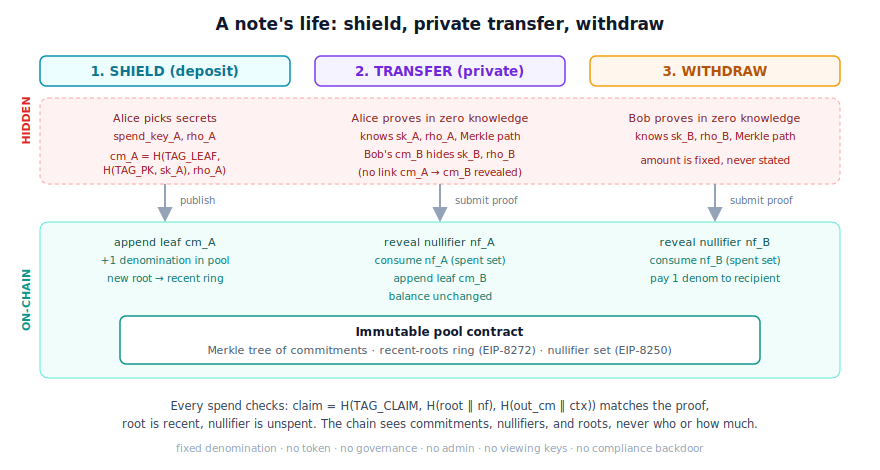
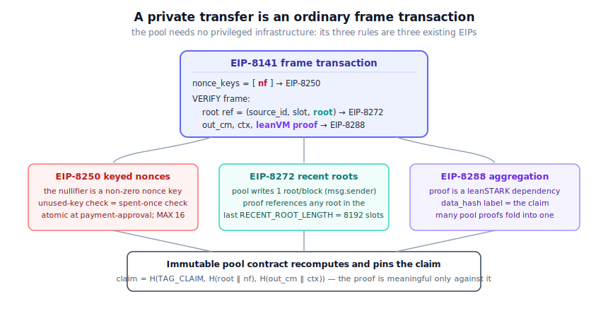

# The PQ shielded pool, explained

A plain-language tour of what this is, how a coin moves through it, and how it
plugs into a devnet. For the code see [pool/](pool/), for the circuit see
[circuits/spend.py](circuits/spend.py), for the devnet mapping see
[devnet/](devnet/README.md).

## The idea in one paragraph

Tornado Cash let you deposit a fixed amount, then later withdraw it to a fresh
address, proving in zero knowledge that you own *one of* the deposits without
saying which. This is the same idea, rebuilt so it survives quantum computers
and runs natively on a modern Ethereum devnet: the only cryptography is hashing,
the proof is a leanVM STARK, and the anti-double-spend and freshness machinery
is borrowed from three EIPs instead of baked into the contract.

## Why fixed denomination

Every note is worth exactly one unit. This sounds like a limitation; it is
actually the core security decision. A pool with arbitrary amounts has to prove,
inside the circuit, that inputs equal outputs and that no amount is negative,
which means range checks over a 31-bit field, the single most error-prone thing
to get right in a STARK. Fixing the denomination deletes that entire class of
bugs: there is no value field, no arithmetic, nothing to overflow. Bigger
amounts are just several notes.

## How a coin moves



- **Shield.** Alice picks two secrets and publishes their commitment
  `cm = H(TAG_LEAF, H(TAG_PK, spend_key), rho)`, depositing one unit. The pool
  appends `cm` to its Merkle tree. The commitment reveals nothing about the
  owner; the deposit's funding address, though, is on-chain and must be
  decorrelated by the wallet.
- **Transfer.** Alice sends the note to Bob privately. Bob gives her only a
  commitment to *his* fresh secrets. Alice proves, in zero knowledge, that she
  owns a note in the tree, and the proof reveals just one thing: a **nullifier**,
  a unique per-note tag only she can compute. The pool consumes the nullifier
  (so the note can't be spent again) and appends Bob's new note. No link between
  the old and new note is visible.
- **Withdraw.** Bob does the same, but instead of creating a new note he names a
  public recipient. One unit leaves the pool.

On-chain, a spend exposes a nullifier, a new commitment (transfer) or a public
recipient address (withdraw), a claim digest, a proof, and a root write. It
never reveals who owns what, the amount (fixed), or which deposit a withdrawal
came from.

## What makes the proof trustworthy

A privacy proof is only as good as the statement it pins down. Five properties
are enforced inside the circuit, each closing a specific way a cheating prover
could otherwise win:

1. **The Merkle path is well-formed** (the direction bits are constrained to be
   0 or 1, not arbitrary field elements).
2. **The tree is real**: the root the prover used is bound into the public claim,
   and the contract only accepts roots it actually published recently. You can't
   prove membership in a tree you invented.
3. **Hashes can't be confused across roles**: the owner key, the note, the
   nullifier, and the claim each hash under a different domain tag.
4. **The nullifier is honest**: it is derived from the spend key and the specific
   note, so it's unique per note and only the owner can produce it.
5. **No double-spend**: the nullifier is published and the contract consumes it
   exactly once.

(These are exactly the five caveats that the
[recursive STARK mempool](https://github.com/soispoke/recursive-stark-mempool)'s
cost-only spend circuit left open. This repo closes all five in a real circuit
and verifies it.)

## How it rides a devnet



The elegant part: the pool contract stays tiny because its three rules are three
existing EIPs. A private transfer is just a frame transaction:

- the **nullifier** is used as an [EIP-8250](devnet/README.md) keyed nonce (spent
  at `nonce_seq = 0`), so the protocol's "each key used once" rule becomes the
  pool's double-spend protection. Two bindings make that true: the pool's
  `VERIFY` logic requires the consumed key to equal the proven nullifier, and
  it requires every spend to come from the pool's one pinned sender, because
  the protocol tracks keys per sender and the same nullifier would be fresh
  under any other sender;
- the **recent root** is an [EIP-8272](devnet/README.md) reference, so a proof
  built a few slots ago is still valid;
- the **proof** rides in an EIP-8141 `VERIFY` frame and can be aggregated with
  other privacy proofs via [EIP-8288](https://github.com/soispoke/recursive-stark-mempool).

So the devnet answers a real question: can a post-quantum privacy protocol be an
ordinary application on top of 8141 / 8250 / 8272? The three EIPs cover the
envelope; the one thing the devnet has to add itself is a verifier for the
proof (a precompile or native `VERIFY`-frame verification, since checking a
STARK in plain contract code is not realistic). If it works, privacy scales on
the same rails as everything else.

## Numbers

On an Apple M5 Max, a spend (transfer or withdraw) proves in **~20-28 ms**,
the proof is **~155-158 KiB**, and anyone verifies it in **~16-18 ms**,
independent of how big the pool's tree is. The reference protocol (`python3 pool/demo.py`) runs
the whole shield → transfer → withdraw flow and refuses both a double-spend and
a forged root, in well under a second.

## Honest limits

This is a research prototype. It is not audited. leanVM's hash security is
about 124-bit classical / 62-bit quantum today, so "post-quantum" is the
direction, not yet a 128-bit guarantee.

Anonymity equals the number of indistinguishable unspent notes at spend time, a
set that is dynamic and can be as small as 1: a spend into a tiny pool is
linkable, so wallets should wait for a sufficient set and avoid
spend-soon-after-deposit timing. Every spend is submitted from the pool's one
pinned sender, which hides who is spending; the deposit's funding address is
still on-chain and must be decorrelated by the wallet (the classic Tornado
deanonymization vector). By design there is no compliance or viewing-key
mechanism.

The devnet mapping is not free either. The pool's on-chain `VERIFY` logic must
bind each proof to its pinned sender, nonce key, root source, and operation
shape (see [devnet/README.md](devnet/README.md)), and those bindings are
trusted contract code, not proven in-circuit; `pool/envelope.py` demonstrates
each one's attack. The devnet must supply the proof verifier itself, and
nobody yet pays the pinned sender's gas: the fee story is an open problem.
Because the protocol consumes the nullifier at payment approval, anything that
makes the pool's later frame revert would burn the spent note, so the contract
keeps that frame revert-free (a duplicate append is a no-op).

The reference pool uses SHA-256 as a stand-in so it runs in plain Python; the
real proof uses Poseidon2, and only the circuit half is the actual security
artifact.

## Run it

```
python3 pool/demo.py        # the whole protocol, self-checking
python3 circuits/spend.py   # confirm the circuit matches the proved harness
```

Proving real spends needs a leanVM checkout; see
[circuits/README.md](circuits/README.md).
